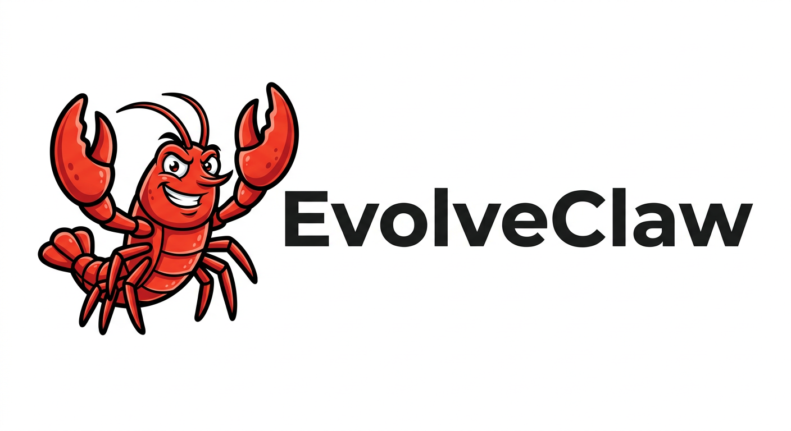
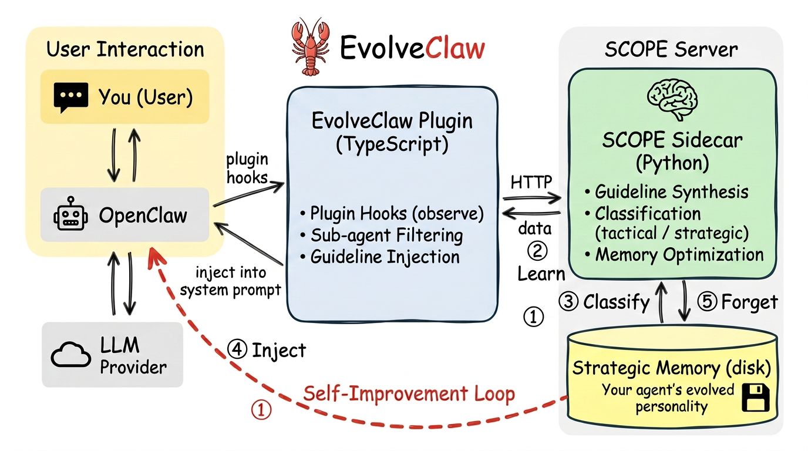

<div align="center">
  

  <h2>A self-evolving, personalized OpenClaw</h2>
  <h3>The more you use it, the better it understands you.</h3>
</div>

<p align="center">
  <a href="https://github.com/JarvisPei/SCOPE"></a>
  <a href="https://github.com/openclaw/openclaw"></a>
  <a href="https://clawhub.ai"></a>
  
</p>

---

## 📰 News

- **[2026/03]** 🔥 **Fully automatic setup** — The plugin now auto-starts the SCOPE server and auto-detects OpenClaw's model configuration. No `.env`, no manual server launch needed!
- **[2026/03]** 🔥 Added **custom SCOPE prompts & domains** tailored for personal AI assistants — user preference learning, code quality analysis, and communication style optimization!
- **[2026/03]** 🚀 **EvolveClaw v1 released!** Self-evolving prompt system for OpenClaw with zero code modification — plugin + sidecar architecture powered by [SCOPE](https://github.com/JarvisPei/SCOPE).

---

EvolveClaw turns [OpenClaw](https://github.com/openclaw/openclaw) into a **self-improving agent** that continuously adapts to *your* workflows. Powered by [SCOPE](https://github.com/JarvisPei/SCOPE) (Self-evolving Context Optimization via Prompt Evolution), it observes how you interact with the agent — your tasks, your tool usage patterns, your preferences — and **automatically evolves the system prompt** with personalized guidelines that make the agent increasingly effective for *you*, not just any user.

No two EvolveClaw instances are the same. Over time, each one develops a unique personality shaped by its owner's habits.

**Key adaptation**: SCOPE was originally designed for task-specific benchmarks (e.g., HLE). EvolveClaw extends it with **custom prompt templates and domain categories** tailored for a personal AI coding assistant — focusing on user preference learning, code quality, communication style, and workflow patterns instead of domain-specific problem-solving heuristics.

## 📝 Contents

- [💡 Why EvolveClaw?](#-why-evolveclaw)
- [⚙️ How It Works](#️-how-it-works)
- [🚀 Quick Start](#-quick-start)
- [🧬 What Makes It Self-Evolving](#-what-makes-it-self-evolving)
- [🏗️ Architecture](#️-architecture)
- [🎯 Design Decisions](#-design-decisions)
- [🔌 API Endpoints](#-api-endpoints)
- [📖 Citation](#-citation)

---

## 💡 Why EvolveClaw?

Today's AI coding agents ship with a static system prompt — every user gets the same instructions. But users are different: some prefer terse answers, others want detailed explanations; some rely heavily on search tools, others write code directly; some work on frontends, others on distributed systems.

EvolveClaw closes this gap with three core ideas:

| Principle | What It Means |
|-----------|--------------|
| **Self-Evolving** | The agent synthesizes behavioral guidelines from its own execution traces. No manual prompt engineering needed — the system prompt improves itself. |
| **Personalized** | Guidelines are derived from *your* interactions — your tasks, your tool usage patterns. The agent adapts to how *you* work, not a generic user profile. |
| **Dual Memory** | Strategic guidelines persist across sessions (your agent's personality); tactical guidelines are ephemeral and auto-clear per task. |

## ⚙️ How It Works

<p align="center">
  
</p>

1. **Observe** — The plugin captures your full interaction trace: model output, tool calls, tool results, errors, and the semantic nature of your task
2. **Learn** — SCOPE analyzes each trace and synthesizes a guideline if warranted — e.g., *"When this user asks for refactoring, prefer small atomic commits over large rewrites"*
3. **Classify** — Each guideline is classified as **tactical** (task-specific, ephemeral) or **strategic** (cross-task, persisted to disk as part of your personal memory)
4. **Inject** — On the next turn, all active guidelines are injected into the system prompt, structured by priority (strategic > tactical)
5. **Forget** — When you start a new session, tactical guidelines are cleared. The agent remembers *who you are* (strategic), not *what you were doing yesterday* (tactical)

This creates a **virtuous cycle**: the more you use the agent, the better it understands your preferences, and the more personalized its behavior becomes.

## 🚀 Quick Start

### 0. Prerequisites — Install OpenClaw

EvolveClaw requires a running [OpenClaw](https://github.com/openclaw/openclaw) instance. If you don't have one yet:

```bash
# Requires Node ≥ 22
npm install -g openclaw@latest

# Run the onboarding wizard (sets up gateway, workspace, channels)
openclaw onboard --install-daemon
```

For more details, see [OpenClaw Getting Started](https://docs.openclaw.ai/start/getting-started). You'll also need **Python ≥ 3.10** for the SCOPE sidecar server.

### 1. Install Python Dependencies

```bash
cd server
pip install -r requirements.txt
```

### 2. Install the Plugin

**Option A — From ClawHub / npm (recommended once published):**

```bash
openclaw plugins install evolveclaw
openclaw gateway restart
```

**Option B — From local source:**

```bash
# Automatically configures OpenClaw to load the plugin
./scripts/install-plugin.sh
openclaw gateway restart
```

The plugin **auto-starts** the SCOPE server when it loads. It detects the `server/` directory relative to the plugin source, spawns `python3 server.py`, and waits for it to be ready. No manual server launch needed.

> **Tip:** If you prefer to manage the server process yourself (e.g., for custom `.env` settings or running on a different host), start it manually before OpenClaw and set `"autoStartServer": false` in the plugin config. The plugin detects a running server via `/health` and skips spawning.

<details>
<summary><b>3. Configure (Optional)</b></summary>

In `~/.openclaw/openclaw.json`:

```json
{
  "plugins": {
    "entries": {
      "evolveclaw": {
        "enabled": true,
        "config": {
          "serverUrl": "http://127.0.0.1:5757",
          "agentName": "openclaw-agent",
          "injectMode": "append_system",
          "maxGuidelines": 30,
        }
      }
    }
  }
}
```

#### 🔧 Plugin Configuration

| Config | Default | Description |
|--------|---------|-------------|
| `serverUrl` | `http://127.0.0.1:5757` | SCOPE sidecar URL |
| `agentName` | `openclaw-agent` | Agent identifier in SCOPE memory |
| `enabled` | `true` | Toggle on/off without uninstalling |
| `injectMode` | `append_system` | `append_system` (cacheable) or `prepend_context` (per-turn) |
| `maxGuidelines` | `30` | Max guidelines in memory; oldest tactical evicted first when cap is reached |
| `scopeModel` | *(auto from OpenClaw)* | Override the model SCOPE uses for guideline synthesis (e.g., `gpt-4o-mini` for cheaper synthesis) |
| `scopeProvider` | *(auto from OpenClaw)* | Override the SCOPE provider: `anthropic`, `openai`, or `litellm` |
| `scopeApiKey` | *(auto from OpenClaw)* | Override the API key SCOPE uses |
| `scopeBaseUrl` | *(auto from OpenClaw)* | Override the base URL for SCOPE's LLM API |
| `autoStartServer` | `true` | Auto-start the SCOPE server if not already running. Set to `false` if you manage the server yourself |
| `pythonPath` | *(auto-detect)* | Full path to the Python binary (e.g., `/path/to/miniconda3/bin/python3`). Tries `server/venv/bin/python3`, `python3`, `python` by default |

> **LLM auto-detection:** By default, EvolveClaw reads OpenClaw's primary model configuration (`api.config.models.providers` + `api.config.agents.defaults.model.primary`) and forwards it to the SCOPE server at startup. No duplicate API key configuration needed. Set the `scope*` fields above only if you want SCOPE to use a different (e.g., cheaper) model than OpenClaw.

#### ⚡ Server Configuration (Environment Variables)

| Variable | Default | Description |
|----------|---------|-------------|
| `EVOLVECLAW_HOST` | `127.0.0.1` | Server bind address |
| `EVOLVECLAW_PORT` | `5757` | Server port |
| `EVOLVECLAW_SCOPE_MODEL` | *(auto from plugin)* | LLM for guideline synthesis; set only to override auto-detection |
| `EVOLVECLAW_SCOPE_PROVIDER` | *(auto from plugin)* | `anthropic`, `openai`, or `litellm`; set only to override auto-detection |
| `EVOLVECLAW_SCOPE_DATA` | `./scope_data` | Directory for persistent strategic rules |
| `EVOLVECLAW_SYNTHESIS_MODE` | `efficiency` | `efficiency` (fast) or `thoroughness` (comprehensive) |
| `EVOLVECLAW_QUALITY_ANALYSIS` | `true` | Analyze successful steps too |
| `EVOLVECLAW_QUALITY_FREQUENCY` | `3` | Analyze quality every N successful steps (recent conversation history is included for context) |
| `EVOLVECLAW_ACCEPT_THRESHOLD` | `medium` | `all`, `low`, `medium`, `high` |
| `EVOLVECLAW_STRATEGIC_THRESHOLD` | `0.85` | Min confidence for strategic promotion |
| `EVOLVECLAW_MAX_RULES_PER_TASK` | `20` | Max rules SCOPE keeps per task |
| `EVOLVECLAW_MAX_STRATEGIC_PER_DOMAIN` | `10` | Max strategic rules per domain |

</details>

## 🧬 What Makes It Self-Evolving

Unlike static prompt engineering or manual rule files, EvolveClaw implements a **self-improvement loop** with the following components:

<details>
<summary><b>🎯 Personalized Learning Signal</b></summary>

- **Rich execution traces**: Captures model output, tool calls (`before_tool_call`), tool results (`after_tool_call`), and errors — learning from the full behavioral footprint, not just text
- **Task description**: The user's last message is extracted and passed to SCOPE for per-task guideline management

</details>

<details>
<summary><b>🧠 Adaptive Memory</b></summary>

- **Strategic memory** — Cross-task guidelines that persist to disk. Loaded on startup
- **Tactical memory** — Task-specific guidelines that live in-memory and auto-clear on session switch
- **Automatic memory optimization** — When strategic rules accumulate past the domain limit, SCOPE's `MemoryOptimizer` automatically consolidates similar rules, prunes rules subsumed by more general ones, and resolves conflicts — all via LLM-driven analysis, not simple truncation
- **Plugin-side guideline cap** — The plugin enforces a maximum guideline count in memory; oldest tactical guidelines are evicted first when the cap is reached

</details>

<details>
<summary><b>🎨 Custom SCOPE Prompts & Domains</b></summary>

SCOPE's built-in prompts are designed for task-specific benchmarks. EvolveClaw overrides them via SCOPE's `custom_prompts` and `custom_domains` API (`server/prompts.py`) to focus on personal assistant concerns:

| Domain | What It Captures |
|--------|-----------------|
| `tool_usage` | IDE/shell tool patterns — file ops, search, terminal commands |
| `code_quality` | Code generation patterns, style, correctness, testing |
| `error_handling` | Safe operations, rollback strategies, error recovery |
| `communication` | Response style, conciseness, explanation depth |
| `user_preferences` | Learned user habits — coding style, frameworks, conventions |
| `context_awareness` | Project structure knowledge, conversation history |
| `workflow` | Multi-step task planning, edit-test cycles |
| `general` | Catch-all for uncategorized rules |

The `user_preferences` domain is particularly important: when the analyzer detects consistent user habits (e.g., "always uses TypeScript", "prefers concise responses"), these are classified as **strategic** and persist across sessions — so the assistant remembers your preferences permanently.

</details>

<details>
<summary><b>🔇 Sub-Agent Filtering</b></summary>

OpenClaw internally spawns sub-agents (file search, code lookup, etc.) that use minimal system prompts. EvolveClaw filters these out — only the main user-facing session generates guidelines. Sub-agent sessions are detected by the `"subagent:"` prefix in the session key and silently skipped across all hooks.

</details>

<details>
<summary><b>💉 Injection Modes</b></summary>

- **`append_system`** (default) — Guidelines are appended to the system prompt, which LLM providers typically cache for token efficiency
- **`prepend_context`** — Guidelines are prepended to the per-turn context, sent fresh each turn

</details>

<details>
<summary><b>📊 Observability</b></summary>

- **Periodic logging** — The plugin logs guideline distribution by type every 5 steps
- **Stats endpoint** — `GET /stats/{agent_name}` returns strategic count, total steps, synthesis rate, and uptime

</details>

<details>
<summary><b>🏗️ Architecture</b></summary>

```
evolveclaw/
├── plugin/                    # OpenClaw TypeScript plugin
│   ├── src/
│   │   ├── index.ts           # Plugin entry: lifecycle hooks, guideline management
│   │   ├── scope-client.ts    # HTTP client for SCOPE sidecar
│   │   └── types.ts           # Shared type definitions (config, API, guideline metadata)
│   ├── package.json
│   └── openclaw.plugin.json   # Plugin manifest with config schema
├── server/                    # SCOPE sidecar HTTP server (Python)
│   ├── server.py              # FastAPI server: step analysis, tactical reset, stats
│   ├── config.py              # Server configuration (env vars)
│   ├── prompts.py             # Custom SCOPE prompts & domains for personal assistant use
│   ├── requirements.txt
│   └── .env.template          # Environment variable template
└── scripts/
    ├── start-server.sh        # Start the SCOPE sidecar
    └── install-plugin.sh      # Auto-configure OpenClaw to load the plugin
```

</details>

## 📋 TODOs and Known Limitations

- [ ] **Feedback loop** — No auto-feedback from the plugin (OpenClaw has no `user_feedback` hook). Could be added once SCOPE supports guideline removal or OpenClaw adds a feedback hook.
- [ ] **Migrate to focused SDK subpaths** — OpenClaw v2026.3.22 introduced `openclaw/plugin-sdk/*` subpaths (e.g., `openclaw/plugin-sdk/plugin-entry`) as the recommended import surface. Our plugin uses the monolithic `openclaw/plugin-sdk` because local-path plugins (`plugins.load.paths`) cannot resolve subpath exports without `npm install` in the plugin directory. This can be resolved by adding `openclaw` as a peer dependency and running `npm install`, or by publishing to ClawHub/npm.

<details>
<summary><b>🎯 Design Decisions</b></summary>

### Why self-evolving prompts (not fine-tuning)?

- **Zero training cost**: No GPU, no dataset curation — guidelines are synthesized in-context by the same LLM
- **Interpretable**: Every guideline is a human-readable sentence you can inspect, edit, or delete
- **Reversible**: Guidelines are human-readable and can be inspected or deleted; fine-tuning is a one-way door
- **Personalized at the prompt level**: Works with any base model — swap `gpt-4o` for `claude` and your guidelines carry over

### Why a sidecar server (not embedded)?

- **Language bridge**: SCOPE is Python; OpenClaw plugins are TypeScript. A sidecar avoids complex Node↔Python IPC
- **Decoupled lifecycle**: The SCOPE server can be restarted, upgraded, or swapped independently of OpenClaw
- **Graceful degradation**: If the SCOPE server is down, the plugin silently no-ops — OpenClaw keeps working normally

### Why plugin hooks (not bootstrap files)?

- **Dynamic**: `before_prompt_build` injects guidelines per-turn, not just at session start
- **System prompt space**: `appendSystemContext` places guidelines in cacheable system prompt space, reducing per-turn token cost
- **Clean lifecycle**: `llm_output` + `before_tool_call` + `after_tool_call` + `agent_end` capture the full step context for SCOPE analysis
- **Bootstrap files still work**: Strategic rules *could* additionally be written to `AGENTS.md` for persistence across restarts

### Zero-latency design

EvolveClaw adds **zero user-perceived latency** to OpenClaw. The only potentially slow operation (LLM-based guideline synthesis) happens asynchronously after the agent has already responded:

| Hook | Blocking? | What it does |
|------|-----------|-------------|
| `before_prompt_build` | Sync, ~0ms | Reads from in-memory guideline array — no HTTP, no I/O |
| `llm_output` | Sync, ~0ms | Stores a string in a variable |
| `before_tool_call` | Sync, ~0ms | Pushes tool name to an array |
| `after_tool_call` | Sync, ~0ms | Pushes result to an array |
| `agent_end` | **Async, fire-and-forget** | HTTP call to SCOPE server → LLM synthesis. OpenClaw does **not** await this — confirmed in source: *"fire-and-forget, so we don't await"* |

New guidelines only appear on the **next** turn, after the background synthesis completes.

### Guideline types

| Type | Scope | Persistence | Injection | Priority |
|------|-------|-------------|-----------|----------|
| **Strategic** | Cross-task | Saved to disk — your agent's evolved personality | Loaded on startup + periodic refresh | Highest |
| **Tactical** | Current task | In-memory only — ephemeral working memory | Cleared on session switch | Lowest (most recent wins) |

</details>

<details>
<summary><b>🔌 API Endpoints</b></summary>

| Method | Path | Description |
|--------|------|-------------|
| `GET` | `/health` | Health check (includes `configured` flag) |
| `GET` | `/rules/{agent_name}` | Get strategic rules for an agent |
| `GET` | `/stats/{agent_name}` | Get observability metrics for self-improvement tracking |
| `POST` | `/step` | Report a completed step for SCOPE analysis |
| `POST` | `/reset` | Reset tactical state on session/task switch |
| `POST` | `/configure` | Forward LLM config from plugin (auto-called at startup) |

</details>

## 🔧 Compatibility

| Component | Tested Version | Notes |
|-----------|---------------|-------|
| OpenClaw | v2026.3.22+ | Uses `openclaw/plugin-sdk` (monolithic, still supported) |
| Python | 3.10+ | For the SCOPE sidecar server |
| Node.js | 22+ | Required by OpenClaw |
| SCOPE | 0.1.3+ | `custom_prompts` and `custom_domains` API required |

## 🔗 Related Projects

- [SCOPE](https://github.com/JarvisPei/SCOPE) — The prompt evolution framework powering EvolveClaw
- [OpenClaw](https://github.com/openclaw/openclaw) — The AI agent platform

## 📖 Citation

```bibtex
@software{pei2026evolveclaw,
  title={EvolveClaw: Evolving OpenClaw's System Prompt via Self-Improving Guidelines},
  author={Pei, Zehua and Zhen, Hui-Ling},
  url={https://github.com/JarvisPei/EvolveClaw},
  year={2026}
}

@article{pei2025scope,
  title={SCOPE: Prompt Evolution for Enhancing Agent Effectiveness},
  author={Pei, Zehua and Zhen, Hui-Ling and Kai, Shixiong and Pan, Sinno Jialin and Wang, Yunhe and Yuan, Mingxuan and Yu, Bei},
  journal={arXiv preprint arXiv:2512.15374},
  year={2025}
}
```

## ⚖️ License

MIT
